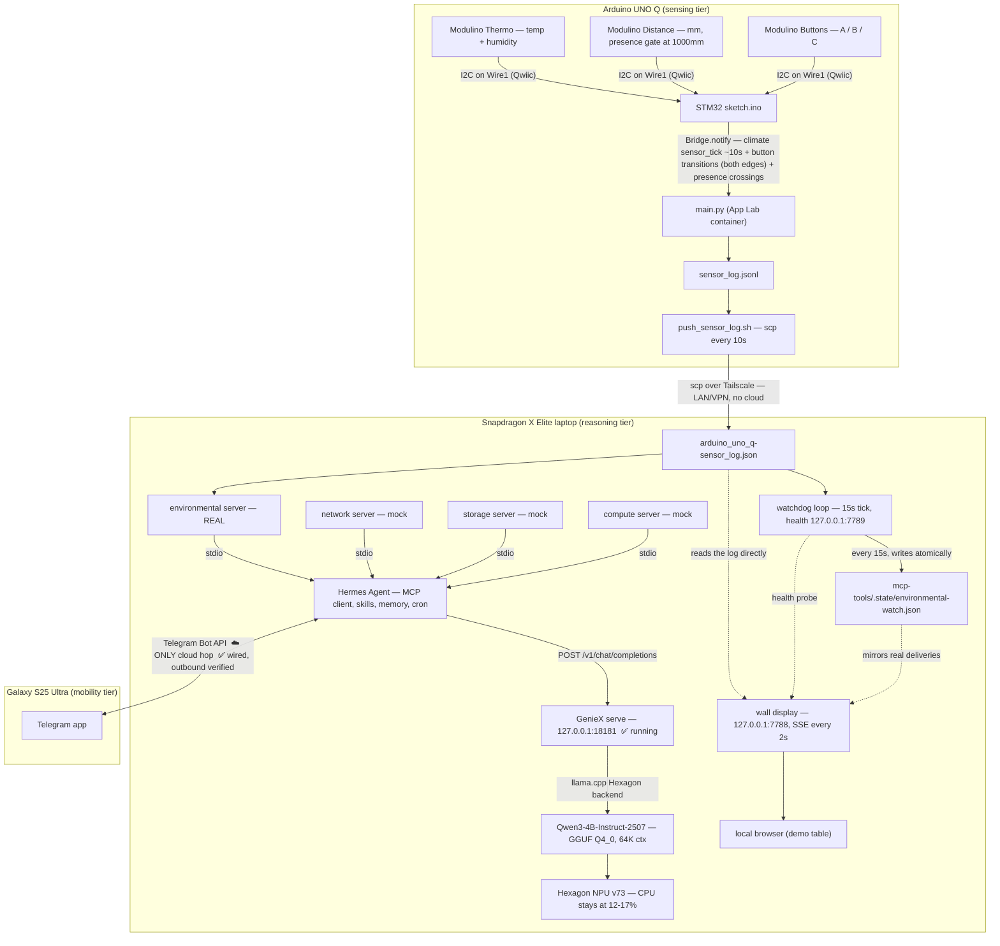
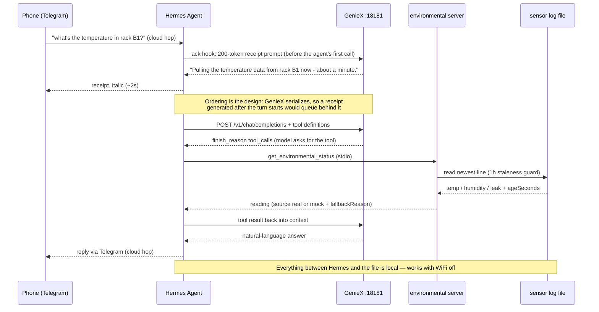
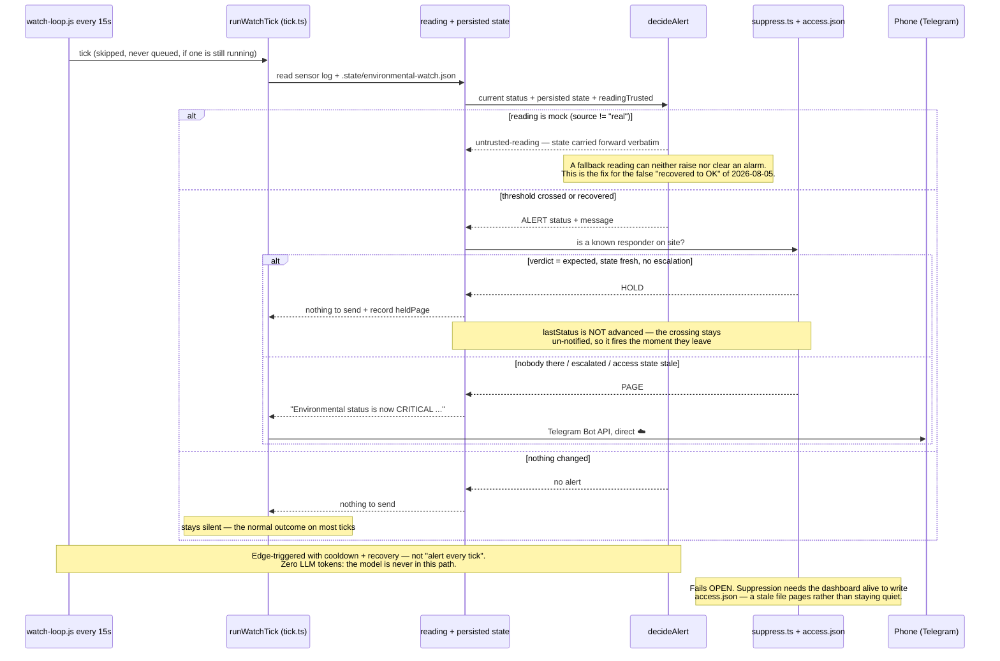
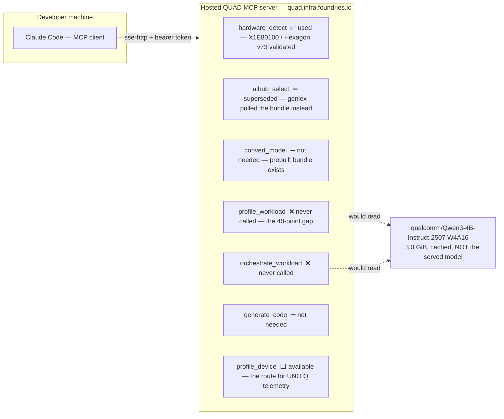

# Architecture — end-to-end flow

Diagrams for how the pieces are actually wired: the runtime demo path, the two request flows,
and where QUAD sits relative to all of it. Terms are defined in [GLOSSARY.md](GLOSSARY.md);
status detail lives in [../PROGRESS.md](../PROGRESS.md) — the `❌`/`⚠️` markers here just point at
items tracked there and in [REVIEW_AND_SENSOR_PLAN_2026-08-03.md](REVIEW_AND_SENSOR_PLAN_2026-08-03.md).

**The one structural fact everything else follows from:** the build-time graph (§3) and the runtime
graph (§1) are **disjoint** — they share the laptop and nothing else. No QUAD output is in the demo
path. That is why QUAD's hosted cloud server doesn't compromise the on-device pitch, and also why
the never-run profiling step costs scoring points without costing any function.

---

## §1 Runtime — what runs during the demo

> Telegram round-trip caveats (found during wiring — details in [../PROGRESS.md](../PROGRESS.md)
> NEXT 4): Hermes must run **non-streaming** against GenieX (`HERMES_FORCE_NONSTREAM=1`; a local
> patch that `hermes update` would revert), and a phone reply takes **2–4 minutes** — scope demo
> questions to one tool call. Non-streaming means the phone sees nothing for those minutes, so
> the gateway sends a model-written **receipt** within ~2 s first (the `ack` hook,
> [../hermes-hooks/README.md](../hermes-hooks/README.md)); §2 shows where it sits in the turn.

Everything inside the laptop box survives a WiFi cut — that is the scoped offline demo beat.
Telegram (and only Telegram) needs the internet.

> **Two later additions this diagram predates** (the validated figure is left as-is on purpose;
> each addition has its own doc). **(1) Phone-NPU failover** — the S25 Ultra is no longer only
> the Telegram surface: when GenieX dies (TCP connect refused, never an HTTP probe), the
> inbound question is answered by the phone's 8 Elite NPU over `adb` (one-shot
> `genie-t2t-run`, no tools, labeled degraded; **12.0 s** message→delivered, n=1, of which the
> phone leg is 7.1 ± 0.7 s over n=5 —
> [../hermes-hooks/README.md](../hermes-hooks/README.md)). **(2) On-board activity inference**
> — the UNO Q itself runs SmolLM2-135M on its CPU, correlating its recent sensor history into
> `activity-*` lines that ride the same push pipeline; the watchdog folds fresh ones into the
> Telegram alert text and the wall streams them ([ONDEVICE_ACTIVITY.md](ONDEVICE_ACTIVITY.md)).
> Net effect: **three devices, three inference tiers** — X Elite Hexagon (the agent), 8 Elite
> Hexagon (failover), UNO Q Cortex-A53 (edge pre-correlation) — each sized to the job it does.

The **wall display** is drawn with dashed edges deliberately: it is a read-only observer, not part
of the reasoning path. It re-derives its numbers by calling the same functions the MCP tools call
(`getEnvironmentalReading`, `assessIncident`, the three family generators) rather than intercepting
anything, so removing it changes nothing about what the agent does or answers. It reads the sensor
log and the watchdog's state file; it writes neither. Detail in [DASHBOARD.md](DASHBOARD.md).

## §2 The two request paths

### Reactive — a human asks

### Proactive — nobody asked

**Cadence.** 15s, from `watch-loop.ts`, which replaced a `hermes cron` job that could not run
faster than ~2 minutes no matter what schedule it was given. Measured sensor-edge-to-phone
latency fell from a 102s worst case to roughly 15–30s. The full measurement, the three
independent reasons cron floors out, and the cutover procedure are in
**[WATCHDOG.md](WATCHDOG.md)**. The one-shot `check-environmental.js` still exists and shares
the same tick code; the legacy cron job can still drive it.

## §3 Build-time — QUAD, a separate graph entirely

**Nothing in this diagram appears in §1.** QUAD's job ends before the demo starts — "model
converted, verified on the NPU, profiled" — and in this project even the convert step was
unnecessary because a prebuilt AI Hub bundle existed.

Live blocker: the `mcp__quad__*` tools are registered (`claude mcp list` → ✔ Connected) but **not
loaded in the current Claude Code session** — a session restart is the precondition for any
profiling run ([../PROGRESS.md](../PROGRESS.md) NEXT item 7).

## §4 One model, two artifacts

The same Qwen3-4B-Instruct-2507 exists on this laptop as two artifacts with incompatible
capabilities — conflating them is the most common confusion in this project:

| | **W4A16 bundle** (qairt path) | **GGUF Q4_0** (llama.cpp path) |
|---|---|---|
| Context | fixed 4K | **64K** (`--nctx 65536`) |
| Tool calls | ❌ not parsed | ✅ structured `tool_calls` |
| NPU | ✅ (qairt) | ✅ (Q4_0 only — Q4_K_M silently falls back to CPU) |
| Role | **profiling / benchmark target** | **serves Hermes** |
| Status | **profiled per-op on Hexagon v73** — [BENCHMARKS.md](BENCHMARKS.md) | live on `:18181` |

Consequence for the writeup and the demo: **profile the bundle, serve the GGUF — and say so
explicitly**, so the benchmark doesn't read as a bait-and-switch. Evidence:
[NPU_SPIKE_RESULTS.md](NPU_SPIKE_RESULTS.md).

## §5 Gap summary — every marker above, tracked elsewhere

| Marker | What | Tracked as |
|---|---|---|
| ✅ periodic sensor sampling | **CR-1 closed** — the sketch emits a `sensor_tick` ~every 10 s *in addition to* event channels, so the tool no longer degrades to mock between presses. Since 2026-08-05 the tick carries **temperature + humidity only** | [REVIEW_AND_SENSOR_PLAN_2026-08-03.md](REVIEW_AND_SENSOR_PLAN_2026-08-03.md) |
| ⚠️ `distance_mm` surfaced | **CR-2 closed**, then narrowed. Distance now reaches the laptop **only** on presence (`object_entered`/`object_left`) and button lines, gated to readings under 1000mm. Because the reader takes the newest line — almost always a tick, which has no distance — **level-based leak detection is no longer reachable**; button C is the live leak path. Restoring it means putting `distance_mm` back on the tick | [../uno-q/hermes-sensor-logger/README.md](../uno-q/hermes-sensor-logger/README.md) |
| ⚠️ Telegram round-trip constraints | wired ✅, but requires the non-streaming local patch (`HERMES_FORCE_NONSTREAM=1`, reverted by `hermes update`) and replies take 2–4 min | [../PROGRESS.md](../PROGRESS.md) NEXT 4 |
| ⚠️ NPU claim now measured, but not by `profile_workload` | The bundle **is** profiled per-op on Hexagon (prefill/decode latency + HTP cycle counts). `profile_workload` itself was unusable — the QUAD server is a remote x86 VM with no Hexagon and no access to local disk — so the numbers come from `qnn-net-run` + `qnn-profile-viewer`, driven by `profile_device_plan` | [BENCHMARKS.md](BENCHMARKS.md), [../PROGRESS.md](../PROGRESS.md) NEXT 7 |
| ✅ proactive alerting, now off cron entirely | Ran as a `--no-agent` Python script under `hermes cron`; the original `.sh` wrapper failed *every scheduled tick* (WSL had no `/bin/bash`, fixed 2026-08-04), and then measurement showed cron could not tick faster than ~2 min regardless of schedule. Since 2026-08-05 the path is `watch-loop.ts`, a 15s persistent loop delivering to Telegram directly. Verify via a real tick, never a one-off run | [WATCHDOG.md](WATCHDOG.md), [E2E_TEST.md](E2E_TEST.md) §7 |

This section is a pointer, not a tracker — status truth lives in PROGRESS.md.
